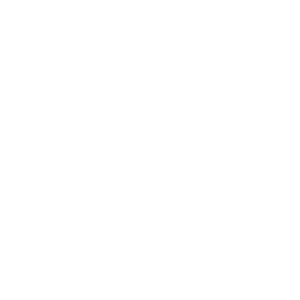

# Branding

## Logo

Use the SVG version of the found logo

<picture>
  <source media="(prefers-color-scheme: dark)" srcset="images/id-logo-edge-4-white.svg">
  <source media="(prefers-color-scheme: light)" srcset="images/id-logo-edge-4.svg">
  
</picture>

Create versions in white, black, and the standard colours.

## Colours

* Complementary
  * $\color{#AA22DD}\textsf{\normalsize Primary}$ #AA22DD 
  * $\color{#55DD22}\textsf{\normalsize Secondary}$ #55DD22

* Monochromatic
  * $\color{#AA22DD}\textsf{\normalsize Primary}$ #AA22DD
  * $\color{#BB4EE4}\textsf{\normalsize Secondary}$ #BB4EE4

* Analogous 
  * $\color{#AA22DD}\textsf{\normalsize Primary}$ #AA22DD
  * $\color{#DD22B2}\textsf{\normalsize Secondary}$ #DD22B2
  * $\color{#4D22DD}\textsf{\normalsize Tertiary}$ #4D22DD

* Triadic
  * $\color{#AA22DD}\textsf{\normalsize Primary}$ #AA22DD
  * $\color{#DDAA22}\textsf{\normalsize Secondary}$ #DDAA22
  * $\color{#22DDAA}\textsf{\normalsize Tertiary}$ #22DDAA

* Tetradic
  * $\color{#AA22DD}\textsf{\normalsize Primary}$ #AA22DD
  * $\color{#DD4C22}\textsf{\normalsize Secondary}$ #DD4C22
  * $\color{#55DD22}\textsf{\normalsize Tertiary}$ #55DD22
  * $\color{#22B3DD}\textsf{\normalsize Quaternary}$ #22B3DD

## Typography

San-serif typeface preferred, preferably Helvetica.

## Images

Simple, punchy, and no more than 4 colours for logos.

Broad vistas for backgrounds.
